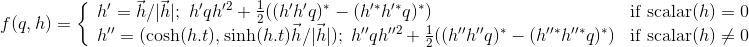

# Rotations Only, the Webapp

This is a webapp to explore rotation functions. The need for this webapp arose from a disagreement. Everyone knows that quaternions
are fine for doing rotations in 3D space using a quaternion triple product. This was first done in 1843 by Rodrigues:

After Einstein developed special relativity, it was his math professor Minkowski who saw that special relativity was just a
rotation in 4D space-time. It was an obvious to look for a way to generalize this triple product to do such a transformation.
If one uses this exact function, real-valued quaternions are not up to the task. Conway and Silberstein in 1911-1912 showed
that if one uses complex-valued quaternions which are not a division algebra, then Lorentz boosts could be done with the
Rodrigues formula.

A century later, I reconsidered this problem. What if more terms were added?

A direct calculation shows that the second part of the function does the Lorentz boost one needs to do the work of special
relativity. This expression was discovered independently by Dr. Kharinov. My name for this function is the Rodrigues
generalized rotation function.

I then hit an unexpected roadblock. Both Dr. Kharinov and a fellow who writes to me under the name Purple Penguin do not
believe this function for boosts can also do 3D rotations! It took me a considerable period of time to write the function
as a two-part function. Now any value can be used for _q_ and _h_ and will always generate a new value _q'_ that preserves
the squared first term.

This streamlit webapp was designed to show the rotations that are obviously possible with the Rodrigues rotation function can also be 
done with the Rodrigues generalized rotation function. A function was written to call the latter in a way that only did
rotations, no boosts.

[Try the live webapp](https://share.streamlit.io/dougsweetser/rotations_only/webapp__rotations_only.py)

It should look like this:

